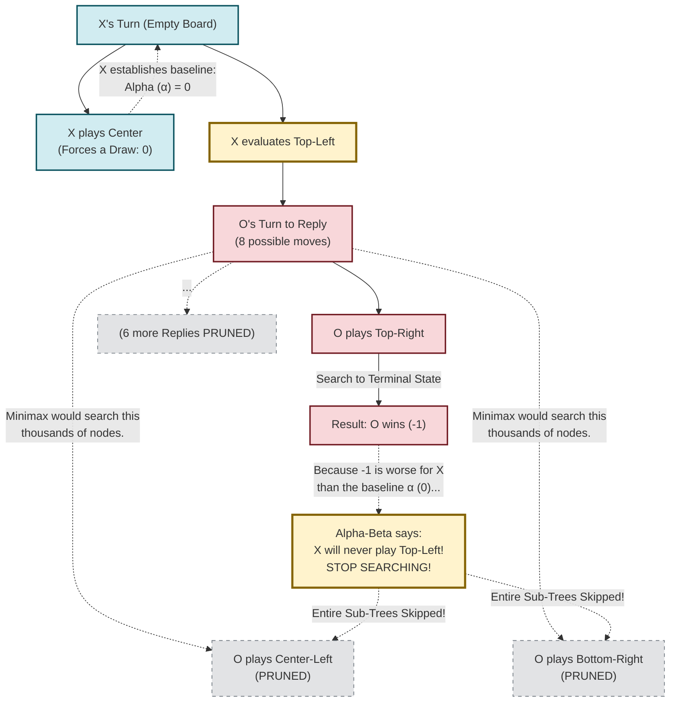

# How Alpha-Beta Pruning Saves 80% of Work in Tic-Tac-Toe

To understand why Alpha-Beta pruning is so much faster than Minimax with Global Bounds, we need to address the most important question: **"If Alpha-Beta stops searching when it finds a trap (-1), didn't it still have to explore the game tree to find that trap in the first place?"**

**Yes, absolutely.** The AI still has to simulate moves all the way to the end of the game to figure out if a path leads to a win, loss, or draw. The magic of Alpha-Beta isn't that it magically knows what a move will do without looking. 

The magic is in **what it skips *after* it looks.** 

Let's break this down with a concrete example.

---

## 1. The Scenario

Imagine it is the start of the game. **X (The Maximizer)** is evaluating its first move. 

1. **X evaluates playing in the Center.** 
   X explores all the possible games that follow a opening Center move. X realizes that if it plays perfectly, it can force at least a **Draw (0)**. 
   *(X now establishes a baseline: $\alpha = 0$. "I will never accept a move that leads to less than 0.")*

2. **X now begins evaluating playing in the Top-Left corner.**
   To evaluate this Top-Left move, X must simulate what **O (The Minimizer)** will do in response. There are 8 empty squares left, so O has **8 possible replies**.

   - **First simulated branch:** X imagines O replies by playing in the **Top-Right** corner. 
   - X continues simulating the game down this specific path. Eventually, X reaches a terminal state and realizes: *"Wait, if O plays in the Top-Right, O can set up a Trap and force me to **Lose (-1)**."*

This is the exact moment both algorithms diverge. 

---

## 2. The Divergence

### How Minimax with Global Bounds Reacts:
Your original code was looking for a `+1`. 
When it sees that O playing Top-Right leads to a `-1`, it thinks: *"Darn, that's not a +1. But O has 7 other possible replies! I better simulate all of them just in case one of those other replies lets me win (+1)."*

So, Minimax proceeds to simulate thousands of games branching off O's other 7 replies. 
**This is a massive waste of time.** Why? Because Minimax assumes O is a perfect player. If O playing Top-Right guarantees O a win (-1), O will *always* choose to play Top-Right. Exploring O's other replies is pointless because O is never going to choose them.

### How Alpha-Beta Pruning Reacts:
Alpha-Beta remembers X's baseline ($\alpha = 0$).
When X sees that O playing Top-Right leads to a `-1`, X thinks: *"If I play Top-Left, O has a response that forces me to lose (-1). But if I play Center, I'm guaranteed at least a draw (0). Therefore, **I will never play Top-Left.**"*

Because X has already mentally rejected the Top-Left move, **X entirely skips simulating O's remaining 7 replies.** It doesn't evaluate a single board state branching off those 7 replies. It simply cuts off the entire branch and moves on to evaluating X's next opening move.

---

## 3. Visualizing the Pruning

The diagram below shows exactly how Alpha-Beta prevents the explosive growth of the search tree by skipping "sibling" branches once a trap is found.

### The Key Takeaway

Yes, Alpha-Beta had to explore a single, narrow path all the way to the bottom to discover the `-1` trap (the path marked `O plays Top-Right`). 

But finding that **one** trap allowed it to completely skip exploring the massive, exponentially growing sub-trees attached to `O plays Center-Left`, `O plays Bottom-Right`, and the other 5 replies. That skipping is the "pruning," and that is exactly how the node count drops from 119,000 down to 22,000 for an empty board.
